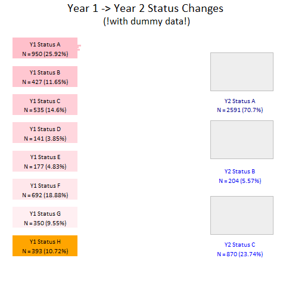

# This a repo for doing an animated sankey in R (ggplot/gganimate)

Here it is: 

  

There are a number of ways to improve it, but this was more of a learning exercise so I'm fine with where it's at.

None of it would be possible without [this](https://www.hvitfeldt.me/blog/recreate-sankey-flow-chart/) resource 
